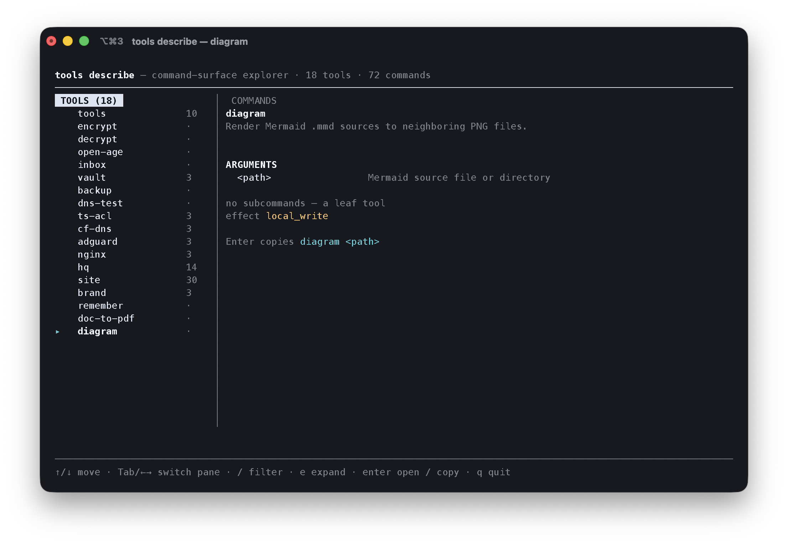

# Cordon

**A language-agnostic command-surface contract.** Declare a command-line tool
once; render every view from that one declaration — human help, shell
completions, docs, and a machine-readable spec — and have every command carry
its **blast radius**, so an automated agent can risk-gate *before* it acts.

> Emit once, render many. One declaration per tool; every surface derived from
> it, so they can't drift — and a deploy can't be mistaken for a read.


<sup>Diagram source: [`docs/diagrams/emit-once.mmd`](docs/diagrams/emit-once.mmd),
pre-rendered with [`diagram`](https://github.com/joeseverino/tools/blob/main/bin/diagram).</sup>

- **Schema:** [`schema/cordon-v4.json`](schema/cordon-v4.json) · canonical `$id` `https://jseverino.com/schemas/cordon-v4.json`
- **Conformance:** [`fixtures/`](fixtures/) + [`conformance/validate.mjs`](conformance/validate.mjs)
- **Checks verdict:** [`schema/cordon-checks-v2.json`](schema/cordon-checks-v2.json) + [`checks/`](checks/) · canonical `$id` `https://jseverino.com/schemas/cordon-checks-v2.json` — the repo-level sibling contract (*is this repo shippable?*)
- **Implementations:** [`docs/EMITTERS.md`](docs/EMITTERS.md)
- **Case study:** [adding the `diagram` tool](docs/DIAGRAM-CASE-STUDY.md)
- **Starter template:** [`cordon-starter`](https://github.com/joeseverino/cordon-starter) · a repo scaffold with the contract, CI gate, and governance already wired

---

## Why this exists

Most "describe your CLI" formats answer *what flags exist*. They don't answer
the question an autonomous agent actually needs: **what happens if I run this?**
A `status` read and a `ship` that deploys to production look identical at the
flag level. Cordon makes the answer a first-class, required field.

Two ideas, working together:

1. **Emit once, render many.** A tool declares its surface in exactly one place.
   Two pure renderers turn that into the human help *and* the machine JSON, so
   there is no prose to parse and the views can't disagree. Generated
   completions, READMEs, and TUIs all fall out of the same source.

2. **Blast radius as a required signal.** Every command (and leaf tool) declares
   an `effect` on a fixed, escalating ladder. It is the one fact a caller can't
   infer from flags — and the hook a runtime gate or an AI session uses to stop
   before doing something irreversible.

## Case study

See [**Adding the `diagram` tool with Cordon**](docs/DIAGRAM-CASE-STUDY.md)
for an end-to-end implementation: one declaration producing help, validated
JSON, generated documentation, shell completion, and command-explorer output.
Writing the case study was also used to gather feedback and refactor the
implementation; all six identified improvements were fixed and verified.



<sup>"Render many" made concrete: a consumer (`tools`) rendering one Cordon
contract as a navigable command-surface explorer — effect chips and all.
Full walkthrough in the [case study](docs/DIAGRAM-CASE-STUDY.md).</sup>

## The effect ladder

```
read  <  local_write  <  vault_write  <  remote_write  <  deploy
```

| effect | means |
|---|---|
| `read` | observes only; no mutation |
| `local_write` | writes to the local filesystem |
| `vault_write` | mutates a system of record / knowledge store |
| `remote_write` | reaches off-box to mutate a remote (API / SSH) |
| `deploy` | ships to production — the irreversible end of the ladder |

Plus two optional boolean tags, emitted only when `true`:

- **`network`** — the requested operation touches a remote / API / SSH. A
  dependency download or package-manager cache miss does not make an otherwise
  local operation networked. This is not derivable from the class: a `read` can
  be networked, while a `local_write` can remain entirely local.
- **`interactive`** — blocks on a TTY (a prompt, `ssh -t`, a full-screen UI).

**The gate principle.** A consumer is expected to risk-gate on `effect` — e.g.
confirm before a `deploy`, fail closed when non-interactive. The signal lives in
the contract; the policy lives in the consumer. (Reference gate:
[`docs/IMPLEMENTERS.md`](docs/IMPLEMENTERS.md#the-runtime-gate).)


<sup>Diagram source: [`docs/diagrams/effect-ladder.mmd`](docs/diagrams/effect-ladder.mmd),
pre-rendered with [`diagram`](https://github.com/joeseverino/tools/blob/main/bin/diagram).</sup>

## The contract

A single JSON object per tool. Required: `ok`, `schema_version`, `name`,
`description`, `group`, `order`, `effect`, `global_options`, `positionals`,
`paras`, `examples`, `commands`. The document is `additionalProperties: false`
and byte-deterministic (no timestamps), so a guard can diff it.

```jsonc
{ "ok": true, "schema_version": 4, "name": "hq", "description": "…",
  "group": "Integrations", "order": 130,
  "effect": "read",                          // tool-level (meaningful for leaf tools)
  "global_options": [ /* <option> */ ],
  "positionals":    [ /* <positional> */ ],
  "paras":     [ "one logical paragraph per entry, unwrapped" ],
  "examples":  [ { "command": "…", "comment": "…" } ],
  "commands":  [ { "name": "restart", "summary": "…", "args": [ /* … */ ],
                   "effect": "deploy", "network": true,
                   "paras": [], "examples": [],
                   "delegates": "owner of these flags, if elsewhere" } ] }
```

See [`schema/cordon-v4.json`](schema/cordon-v4.json) for the full definition of
`<option>` / `<positional>` / `<example>` / `<command>`.

## Conformance

An emitter conforms when its output validates against the schema, satisfies the
cross-field rules in `conformance/semantics.mjs`, and behaves the way the
fixtures specify:

```bash
npm ci
node conformance/validate.mjs                 # run the fixture suite
node conformance/validate.mjs path/to/out.json  # validate one document
some-tool --describe | node conformance/validate.mjs -   # validate stdin
```

`fixtures/valid/` must pass; `fixtures/invalid/` must be rejected, each isolating
one rule. They are the contract's executable definition — implement against
them in any language.

## The checks verdict

Cordon's second contract — the repo-level sibling of the command surface. Where
`--describe` answers *what does running this command cost?*, the verdict answers
*is this repo shippable, and what fixes each failure?* — the machine-readable
output of a portable checks runner ([`checks/`](checks/)).

- **Its own schema.** [`schema/cordon-checks-v2.json`](schema/cordon-checks-v2.json),
  independently versioned (`schema_version: 2`); `cordon-v4.json` stays frozen.
- **Same harness.** A verdict validates through `conformance/validate.mjs`, which
  picks the schema by shape — `commands[]` → surface, `checks[]` → verdict.
- **Same vocabulary.** Every check carries an `effect` on the ladder above, so an
  agent reads the cost of *producing* a verdict in the same terms as a command.
- **Acts, not just reports.** A failed check must carry its `fix` and exact
  `rerun`, so the verdict is something an agent acts on, not merely parses.

Depth — the checks-vs-tests boundary, per-repo config, and how to add a check —
lives in [`checks/README.md`](checks/README.md).

## Consuming cordon from another repo

`conformance/validate.mjs` is the **supported way for another repo to validate
its own contracts**, not just cordon's internal CI tool. Single-document mode is
a stable entry point within a schema version:

```bash
node "$CORDON_HOME/conformance/validate.mjs" path/to/contract.json   # exit 0 valid, 1 invalid
```

**Reference this repo; don't vendor the schema.** A copied `cordon-v4.json`
drifts silently, and the published `https://jseverino.com/schemas/cordon-v4.json`
is bot-gated (200 in a browser, 403 from CI / datacenter IPs). Point a
`$CORDON_HOME`-style variable at a checkout of this repo — a local clone, or a CI
checkout of the public repo — and call the validator from there. You then
validate against the exact, byte-identical schema for the version your contract
pins (the canonical home is the live `$id` URL; this repo is its mirror).

## Writing an emitter

You don't share code across languages — you converge on this output. Two honest
shapes, depending on what your runtime gives you:

- **Introspect** an existing structured parser (e.g. Python `argparse`, Go
  `cobra`) and project it to the contract.
- **Declare** a small DSL when the runtime has no introspectable parser (e.g.
  shell), and render the contract from that declaration.

Full guide: [`docs/IMPLEMENTERS.md`](docs/IMPLEMENTERS.md). Known emitters:
[`docs/EMITTERS.md`](docs/EMITTERS.md).

## Versioning

The on-wire `schema_version` integer is the contract revision: the schema URL
tracks it (`cordon-v4.json` ↔ `schema_version: 4`); a future breaking shape ships
as `cordon-v5.json` and old consumers keep validating against v4. The name
*Cordon* is the standard; the number is the contract revision. The repo itself is
released on SemVer — see [`CHANGELOG.md`](CHANGELOG.md), which records both axes.

## Local development

Run `scripts/setup-hooks.sh` once per clone to enable the tracked git hooks
(`core.hooksPath` → `.githooks/`):

- `pre-commit` blocks commits on `main`/`master` (bypass: `ALLOW_MAIN_COMMIT=1`).
- `commit-msg` rejects AI attribution trailers — commits stay solo-authored
  (bypass: `git commit --no-verify`).
- `pre-push` runs `npm test`, the same conformance gate CI runs, so red never
  leaves the machine (bypass: `git push --no-verify`).

## License

[MIT](LICENSE) © Joe Severino
