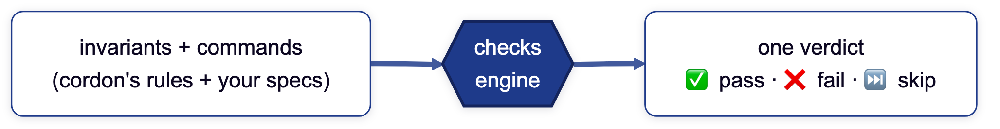

# Cordon checks

A portable **gate engine** — the repo-level sibling of `conformance/`. Where
conformance answers *"does this command surface match the contract?"*, checks
answer *"is this repository shippable, and what fixes each failure?"* Both are the
same idea cordon exists for: **a guarantee declared once, centrally, that a repo
*references* instead of reimplementing** — so it can't drift, and an agent reads
the verdict before it acts.



The engine runs every applicable check over a repo, in phase order, skipping
fail-soft what the environment can't satisfy, and emits one machine-readable
verdict ([`schema/cordon-checks-v2.json`](../schema/cordon-checks-v2.json)).
[See a real run report →](example-report.md) · [the full flow ↓](#the-full-flow).

```
checks/
├── run.mjs              the engine — merge, capability-gate, phase, verdict, report
├── registry.mjs         the inventory of built-in invariants (data + module refs)
├── catalog.mjs          the inventory of built-in commands (per-stack, auto-detected)
├── config-schema.mjs    derives the cordon.checks.json schema from each check
├── selftest.mjs         hermetic engine self-test (npm test runs it)
└── lib/
    ├── <id>.mjs            one invariant each: { id, name, effect, fix, gates, run(ctx) }
    ├── capabilities.mjs    detect git/macos/ci/built-dir/file:/glob:/<binary> — "respect what's available"
    ├── discover-scripts.mjs synthesize read checks from a repo's package.json check:* scripts
    ├── shellcheck-repo.sh  shell-file discovery for the catalog's shellcheck (ext + shebang)
    ├── run-process.mjs     the spawn harness for command entries (timeout, capture)
    ├── built-tree.mjs      resolve + walk a build's output (the post-build invariants)
    └── config.mjs          defaultsOf(configSchema) — runtime defaults from the one declaration
```

## Two kinds of check — invariants and commands

| | **invariant** | **command** |
|---|---|---|
| what | an in-process portable rule | a spawned spec (a binary/script) |
| examples | `repository-policy`, `internal-links` | `ruff`, `pytest`, `playwright`, a bespoke audit |
| lives in | cordon (`registry.mjs`) | cordon's catalog (`catalog.mjs`) **or** the repo (`cordon.checks.json`) |
| why there | a *general* rule, so it's referenced not reimplemented | per-stack ones graduate to the catalog; repo-specific ones stay home |

The engine merges both at run time and runs them through one loop, so a verdict
row looks the same whichever kind produced it. This is the boundary doctrine made
mechanical: **invariant *definitions* graduate up here; command *definitions* stay
home** — but the *engine* is central, so neither repo reimplements the runner, the
verdict, the phases, or the capability gating.

### Where commands come from — auto-detect first, declare only what's bespoke

A command can reach the engine three ways, and the **common case is none of your
doing**:

1. **cordon's catalog** (`catalog.mjs`) — per-stack checks (`ruff`/`pytest` for a
   uv repo, `django-check` for Django, `conformance`/`drift` for a cordon-tool
   repo, `shellcheck` for anything with shell). Each is gated by a stack marker
   (`file:pyproject.toml`, `file:manage.py`, `glob:**/*.sh`…), so it lights up
   **only** where its stack is present. A repo gets them with no config. `pytest`
   additionally runs **once per Python version** the package declares in
   `[project].classifiers` (`uv run --python <v> pytest`) — multi-version coverage
   as one check, no CI matrix, and it runs locally too. Override with
   `{ "pytest": { "pythonVersions": [...] } }`, or `[]` for a single run.
2. **Discovery** (`discover-scripts.mjs`) — your `package.json` `check:*` scripts
   are read in as `read` checks. Declare a bespoke audit once, where you already
   keep tasks; cordon picks it up. No re-listing.
3. **Your `commands[]`** — the escape hatch for a spawned spec the catalog
   doesn't cover, with its blast-radius `effect` declared. An id here overrides a
   catalog check of the same id (repo wins).

So **most repos carry no `cordon.checks.json` at all** — the engine detects the
stack and runs the right checks. You write a file only to *deviate*: flip a check
on/off by name with `enable`/`disable`, tune a built-in's options, or add a truly
bespoke `commands[]` entry. Run `--list` to see exactly what a repo resolves to,
each row marked `run`/`skip` with its source and reason.

### checks vs tests — the boundary

> A **check** asserts a *general invariant about an artifact* (the repo, its
> build output, its config). The rule is universal → it graduates here as an
> invariant and every repo references it.
>
> A **test** exercises the *behavior of code a specific repo wrote* (a parser, an
> API handler, a rendered page). It's coupled to its subject → it stays in that
> repo's `tests/`, and the repo runs it through the engine as a **command** entry.

If a check needs to know what *your* code does, it's a command (home), not an
invariant (graduated). Don't push it up to cordon.

## Gates and phases

Each check declares the `gates` it belongs to, and a gate is just
`checksFor(name)` over the registry — **completeness is structural**: register a
check and every gate that claims it runs it, no second edit. cordon ships one
gate, `check`; a consumer adds its commands to its `cordon.checks.json` and they
join the run.

**Phases** order the run around the build: `pre-build` → `build` → `post-build`.
A check declares its `phase` (default `pre-build`); the engine runs phases in
order and **re-detects capabilities between them**, so a `build` command emits
output and the `post-build` invariants that `require` it then see it. The build
itself is just a `command` with `phase: 'build'`, so a consumer needs no
orchestrator — the engine *is* the orchestrator. `--phase <p>` runs one phase
(a fast inner loop).

## Capabilities — respect what's available, default lean

A check declares the capabilities it `requires`; the engine detects what's
present and **skips fail-soft** what isn't, naming the unmet ones in the verdict.
So a repo lights up only what it opts into — playwright runs only where playwright
is installed, a `built-dir` check only after a build, a `macos` visual suite never
fails a Linux runner. This is also the **stack auto-detection**: a catalog check
`requires` a marker (`file:uv.lock`, `file:manage.py`), so it runs only in that
stack and skips everywhere else.

| capability | true when |
|---|---|
| `git` | the root is a git work tree |
| `macos` | running on Darwin |
| `ci` | `process.env.CI` is set |
| `built-dir` | a build emitted a non-empty output dir (see `builtDirs`) |
| `file:<path>` | a file or dir exists at `<root>/<path>` — the stack marker (e.g. `file:pyproject.toml`) |
| `glob:<pattern>` | at least one path matches, ignoring `node_modules/` and `.git/` (e.g. `glob:**/*.sh`) |
| `<binary>` | any other token resolves on PATH or in `node_modules/.bin` (e.g. `playwright`) |

A leading `!` negates — `requires: ["!ci"]` means *only when not in CI* (the
portable form of an authoring-machine-only check). The vocabulary is
[`lib/capabilities.mjs`](lib/capabilities.mjs).

## The full flow


<sup>Diagram source: [`docs/diagrams/checks-engine.mmd`](../docs/diagrams/checks-engine.mmd),
pre-rendered with [`diagram`](https://github.com/joeseverino/tools/blob/main/bin/diagram).</sup>

## Run it

```sh
node checks/run.mjs                 # all applicable checks over the cwd (human)
node checks/run.mjs --root <dir>    # over another repo
node checks/run.mjs --phase <p>     # only pre-build | build | post-build
node checks/run.mjs --only <id>     # one check (this is the printed rerun line)
node checks/run.mjs --json          # the agent/CI contract (sole stdout)
node checks/run.mjs --list          # the checks that apply to this repo
node checks/run.mjs --schema        # the cordon.checks.json JSON Schema
```

A consuming repo references this the same way it references the conformance
harness — by `$CORDON_HOME`, never vendored:

```sh
node "$CORDON_HOME/checks/run.mjs" --root "$PWD"
```

## The `--json` contract

The repo-level analog of `--describe`: a machine-readable verdict an agent or CI
acts on without parsing prose. `ok` is the gate; each failed check carries its own
`fix` and the exact `rerun` command.

```json
{
  "ok": false,
  "schema_version": 2,
  "failed": ["internal-links"],
  "report": ".cordon-checks-report.md",
  "checks": [
    { "id": "repository-policy", "name": "Repository Policy", "status": "pass",
      "durationMs": 22, "effect": "read", "phase": "pre-build" },
    { "id": "internal-links", "name": "Internal Link Integrity", "status": "fail",
      "durationMs": 36, "effect": "read", "phase": "post-build",
      "fix": "…", "rerun": "node checks/run.mjs --only internal-links" },
    { "id": "browser-tests", "name": "Playwright Browser Tests", "status": "skip",
      "durationMs": 0, "effect": "local_write", "phase": "post-build",
      "unmet": ["playwright", "macos"] }
  ]
}
```

This verdict is a **versioned contract** — [`schema/cordon-checks-v2.json`](../schema/cordon-checks-v2.json),
the repo-level sibling of the command-surface schema — and `checks/run.mjs --json`
is its reference emitter, validated by [`conformance/validate.mjs`](../conformance/validate.mjs)
(the harness picks the contract by shape, then the version by `schema_version`,
so v1 verdicts stay valid). The schema enforces the signals an agent needs: a
`fail` check **must** carry `fix` + `rerun`, every check carries its own `effect`,
and `unmet` may ride only a `skip`.

The two signals the engine adds over v1:

- **`phase`** — where the check ran around the build. Emitted on every row when
  the run spans more than one phase; omitted when it's a single (pre-build) pass,
  so the common case stays minimal.
- **`unmet`** — the capabilities a skipped check needed but the environment
  lacked. This is what makes a skip *legible*: an agent reads *why* playwright
  skipped (not installed vs wrong platform), not just that it did.

`effect` is cordon's blast-radius ladder applied to the check itself — the cost of
*producing* the row, in the same vocabulary a command's `--describe` uses. A
`read` invariant is safe to run anywhere; a check that reaches off-box rides
`network: true` (and `interactive: true` if it blocks on a TTY), emitted only when
true. A **command** entry carries the `effect` its registry declares — so an
unclassified spec can never run as if it were a safe read (the engine fails closed
on a command with no `effect`).

`status` is `pass | fail | skip`. A check skips when a capability is unmet
(`unmet` names it) or when the artifact it inspects is simply absent (no `.nvmrc`,
not a git repo) — **fail-soft** either way. Zero config still runs every universal
invariant.

## The report (`.cordon-checks-report.md`)

The human render of the same `results` the `--json` verdict derives from — a
whole-picture **status table** (every check, not just failures, so a *skip* is
never mistaken for a *pass*), then each failure's `fix` + `rerun` + the captured
output folded in a `<details>`, then a provenance footer. Markdown, so a CI step
(`cat … >> "$GITHUB_STEP_SUMMARY"`) renders it inline in the run summary.

It is written **on failure** by default, so a green local run leaves no file
behind. `--report` writes it even when green (the always-there record), and a CI
run (the `CI` env) turns that on automatically — so the summary is always there in
CI but never clutters a local green run. It is **gitignored, never committed**.
(The `--json` `report` field stays the *failure* pointer: the path on failure,
`null` on a green run.)

See [**`example-report.md`**](example-report.md) for a real one — a failing CI run
and a green run, side by side.

## Per-repo configuration

**The file is optional, and usually absent** — the catalog auto-detects the stack
and discovery picks up your `check:*` scripts, so most repos run the right checks
with no `cordon.checks.json` at all. You add one only to *deviate*. When you do,
the bare-minimum knobs are names only:

- **`disable: ["<id>"]`** — turn an auto-detected check off. Just its name; no
  effect, command, or fix to restate.
- **`enable: ["<id>"]`** — turn an opt-in (`default: 'off'`) catalog check on.

Beyond that, a check-id key tunes a built-in's options (handed to it as
`ctx.config`, merged over its defaults); `builtDirs` and `commands` configure the
engine. Point its `$schema` at the published schema and your editor autocompletes
every key, documents it on hover, and flags typos as you type:

```json
{
  "$schema": "https://jseverino.com/schemas/cordon-checks-config-v2.json",
  "disable": ["pip-audit"],
  "enable": ["playwright"],
  "builtDirs": ["dist"],
  "repository-policy": { "allowTaggedActions": false },
  "internal-links": { "origin": "https://example.com", "dynamicRoutePrefixes": ["/api/"] },
  "commands": [
    { "id": "types", "name": "Type check", "effect": "read",
      "requires": ["tsc"], "exec": { "cmd": "npx", "args": ["tsc", "--noEmit"] } }
  ]
}
```

Absent file or absent keys → auto-detected defaults. This is the seam that lets
one engine run unmodified across repos: the *rules, runner, and per-stack checks*
are central, only the *deviations* are local.

### The config schema is derived, never hand-written

An invariant declares its config seam **once**, as a `configSchema` JSON Schema
fragment on its default export — and that single declaration is the source for
both the check's runtime defaults (`defaultsOf` in [`lib/config.mjs`](lib/config.mjs))
and its slice of the published file schema. [`config-schema.mjs`](config-schema.mjs)
composes those fragments over the registry — plus the engine's own `builtDirs` and
`commands[]` shape — into one document, emitted by `run.mjs --schema`. So adding a
knob is one edit in one file, and a field's type, docs, and default can't drift.

The composed document is committed at [`config.schema.json`](config.schema.json)
— the artifact the `$schema` URL serves — and cordon keeps it fresh by
**dogfooding its own `idempotence` check**: cordon's [`cordon.checks.json`](../cordon.checks.json)
runs the regen command, so `npm run checks` fails if the committed schema ever
lags the source. Editor experience and drift safety from the same one feature.

## Adding a check

**An invariant** (portable — graduate it here):

1. Write `checks/lib/<id>.mjs` exporting `{ id, name, effect, gates, fix, run(ctx) }`,
   plus optional `{ configSchema, requires, phase }`. `effect` is its blast radius
   (`read` for a pure inspection; add `network`/`interactive` if it reaches off-box
   or needs a TTY). `requires` are the capabilities it needs (so a build-dependent
   check declares `requires: ['built-dir'], phase: 'post-build'`). `run({ root,
   config, builtDirs })` returns `{ ok, detail }` or `{ skipped, detail }` — and
   never throws for a violation (throw only on a broken environment).
2. If it takes config, add a `configSchema` and derive defaults with
   `defaultsOf(configSchema)` — one declaration feeds runtime *and* the file schema.
3. Register it in `registry.mjs`.

The new check's knobs then light up in `--schema`, every editor pointed at the
published file, and `--list`/`--json` with no second edit. Graduate a check from a
product repo only when it passes the boundary test: a general invariant with at
most a small declarative config seam. See `lib/repository-policy.mjs` and
`lib/internal-links.mjs` (both graduated from `jseverino.com`) as references.

**A catalog command** (a per-stack check every repo of that stack should get): add
an entry to `CATALOG` in [`catalog.mjs`](catalog.mjs) — `{ id, name, effect, exec,
fix }` plus a `requires` of stack markers (`file:…`/`glob:…`/`<binary>`) that gate
it to its stack, and `default: 'off'` if it should be opt-in. It then
auto-detects in every matching repo with no per-repo config. This is a command's
equivalent of graduating an invariant: a check that's the same in every uv (or
Django, or shell) repo belongs here, not copy-pasted into each `cordon.checks.json`.

**A repo command** (a spec unique to one repo — keep it home): add an entry to
`commands[]` in your `cordon.checks.json` (the editor autocompletes the shape), or
— if it's a Node audit — just name it `check:<thing>` in `package.json` and
discovery folds it in. No code in cordon; the engine spawns it, gates it on its
`requires`, and folds it into the same verdict.
