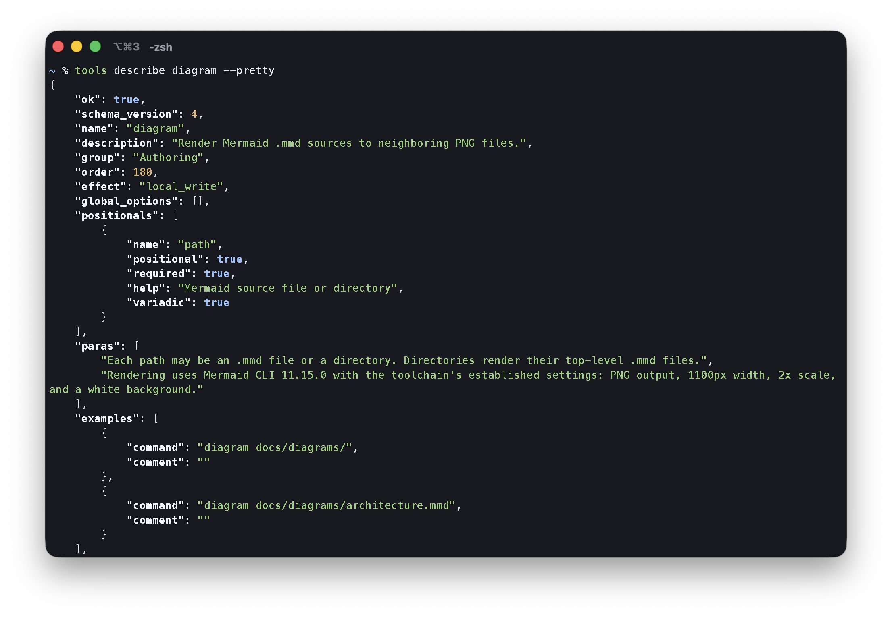
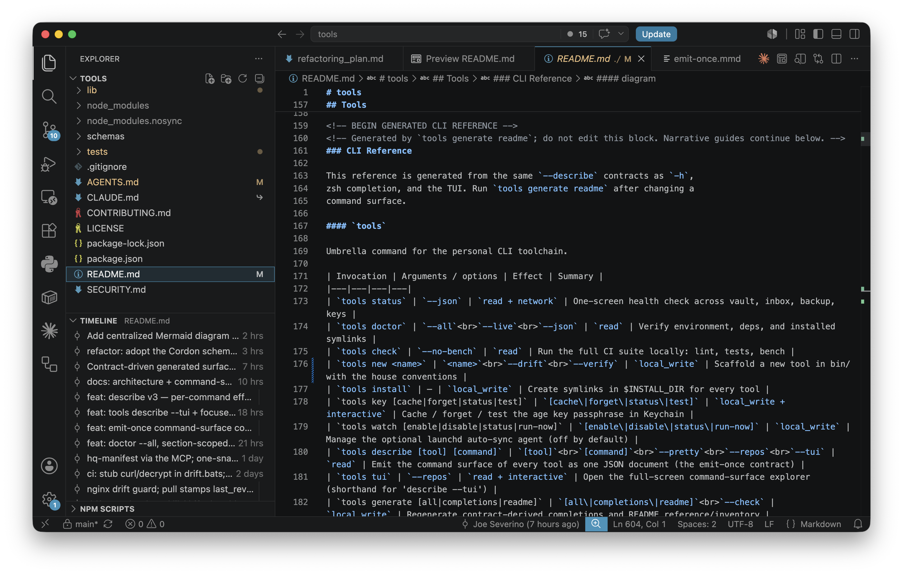

# Case study: adding the `diagram` tool

The `diagram` command is a small but useful test of Cordon's central claim:
declare a command once, then derive every surface from that declaration.

The implementation renders Mermaid `.mmd` sources to neighboring PNG files. It
was added to the public
[`tools`](https://github.com/joeseverino/tools/blob/main/bin/diagram) suite,
then used to standardize diagrams across five repositories.

## The declaration

The command surface is nine Cordon DSL calls:

```bash
describe_spec() {
    desc_tool "diagram" "Render Mermaid .mmd sources to neighboring PNG files."
    desc_inventory "Authoring" 180
    desc_effect local_write
    desc_synopsis "diagram <path>..."
    desc_para "Each path may be an .mmd file or a directory. Directories render their top-level .mmd files."
    desc_para "Rendering uses Mermaid CLI 11.15.0 with the toolchain's established settings: PNG output, 1100px width, 2x scale, and a white background."
    desc_pos path +variadic -- "Mermaid source file or directory"
    desc_example "diagram docs/diagrams/"
    desc_example "diagram docs/diagrams/architecture.mmd"
}
```

That declaration captures the public interface, inventory placement, operational
effect, prose, argument shape, and examples. The rendering loop below it only
implements behavior; it does not maintain a second copy of the command's
documentation.

## What Cordon derived

The same declaration produced every user- and machine-facing surface:

| Surface | Derived result |
|---|---|
| Human help | `diagram -h` with synopsis, prose, effect, arguments, and examples |
| Machine contract | `diagram --describe` as a Cordon v4 JSON document |
| Risk signal | `effect: local_write`, with no remote-network tag |
| README reference | A generated `diagram` section in the tools documentation |
| Shell completion | Generated zsh completion for the variadic path argument |
| Command explorer | Automatic discovery in the tools TUI |
| Validation | JSON Schema validation and cross-tool inventory checks |

Nothing in that list required a separately maintained help heredoc, README
section, completion definition, TUI entry, or agent policy record. Changing the
declaration changes all of them together.


The command explorer discovers `diagram` from the same contract and presents
its argument shape and `local_write` effect without a hand-maintained registry.



The machine-facing view exposes that declaration as validated Cordon v4 JSON,
including the corrected local-only effect signal.



The committed README reference is generated from the same contract. The source
is visibly marked as generated, so contributors know to change the declaration
and regenerate instead of editing a second description by hand.

This was the strongest part of the experience. Adding a fully integrated tool
was mechanical: describe the command honestly, implement its behavior, generate
the derived artifacts, and run the existing checks.

## Efficient MCP discovery

Cordon also made the surface efficient for an agent to consume. During this
review, the `severino-vault-mcp` server's actual `describe_commands` MCP tool was
called. In about 132 ms, one structured call returned the server's complete
Cordon v4 command surface, generated by introspecting the same Python `argparse`
parser that powers `--help`:

```text
describe_commands()
```

```json
{
  "ok": true,
  "schema_version": 4,
  "name": "severino-vault-mcp",
  "effect": "read",
  "commands": [
    {
      "name": "doctor",
      "effect": "read",
      "args": [{ "name": "--propose", "takes_value": false }]
    },
    {
      "name": "apply-writeup-plan",
      "effect": "vault_write",
      "args": [{ "name": "--pretty", "takes_value": false }]
    },
    {
      "name": "describe",
      "effect": "read",
      "args": [{ "name": "--pretty", "takes_value": false }]
    }
  ]
}
```

The JSON above is an abbreviated view of the real response. The call returned
every command, argument, choice, summary, and effect. An agent therefore did not
need to read Python files, scrape `--help`, or spend separate calls discovering
individual commands. The Bash `diagram` declaration and the Python MCP parser
arrived in the same validated shape; `tools describe --repos` can federate both.

## The effect signal

`diagram` writes PNG files locally, so its effect is `local_write`. It does not
declare `network`: rendering is a local operation. A package-manager cache miss
may cause `npx` to resolve the pinned renderer, but that dependency mechanism is
not the command's requested operational reach.

That distinction is useful. A caller sees the local mutation without mistaking
dependency resolution for an API, SSH, or remote-system operation.

## What took the time

Cordon was not the expensive part of this change. Most of the work was outside
the command itself:

- moving sources and PNGs into a uniform `docs/diagrams/` layout;
- replacing copied `render.sh` files across repositories;
- converting live Mermaid fences to committed static images;
- updating documentation links;
- discovering two stale historical PNGs;
- pinning Mermaid CLI 11.15.0;
- isolating one antialiasing-sensitive node shape so repeated renders became
  byte-identical; and
- coordinating five pull requests and their CI pipelines.

Creating the Cordon-conformant command was roughly 10–15% of the total effort.
The cross-repository migration and reproducibility work made up the rest.

## Assessment

**Rating: 4.5 out of 5.**

Cordon made the interface work unusually easy and kept every derived surface
aligned. It is especially compelling for a suite of commands used by humans,
automation, and agents.

I would recommend it for multi-command CLIs and shared toolchains. A single
tiny standalone command may not need the surrounding machinery, but the value
increases quickly once a project needs help text, structured discovery,
completions, generated documentation, or operational risk metadata.

**Likelihood of using Cordon on a suitable next project: 4 out of 5.**

## Feedback outcomes

This case study was not written only as a record after the work was complete.
Drafting it was used as a structured review of the implementation and the
Cordon authoring experience. That review exposed six concrete improvements,
which were then implemented and verified as part of the same change:

1. **Inventory-count assertions now derive from the executable inventory**
   instead of duplicating a literal total.
2. **`tools new <name> --verify` now provides a first-class scaffold path** that
   regenerates derived surfaces and runs the full non-benchmark check.
3. **Network semantics are explicit:** the tag means the requested operation
   reaches a remote system; dependency resolution does not count.
4. **Dependency pinning is documented without mutating v4.** Mermaid CLI
   11.15.0 stays pinned in the implementation. Structured dependency metadata
   is reserved for a future schema version because adding a key would break
   v4's closed shape.
5. **Bare leaf invocation is documented as emitter policy,** with the reference
   Bash emitter's help-first behavior called out explicitly.
6. **This case study is the end-to-end leaf-tool example:** variadic positional,
   non-read effect, generated surfaces, tests, and deterministic output.

These changes keep the stable v4 contract intact while removing unnecessary
hard-coding and making the implementation path clearer. The published case
study therefore documents both the original experience and the refactoring it
directly prompted; the feedback described here is resolved work, not a future
wish list.
